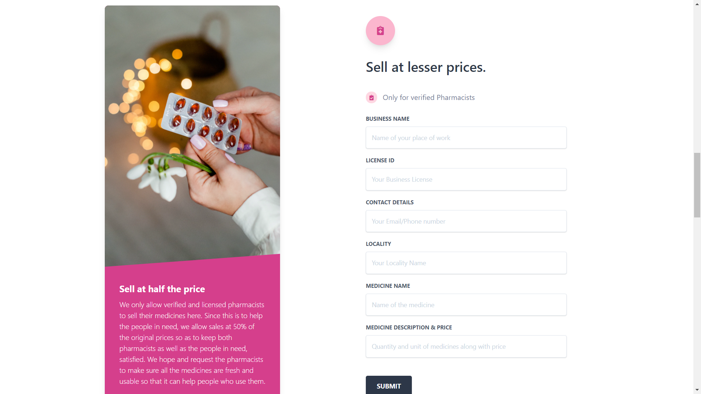
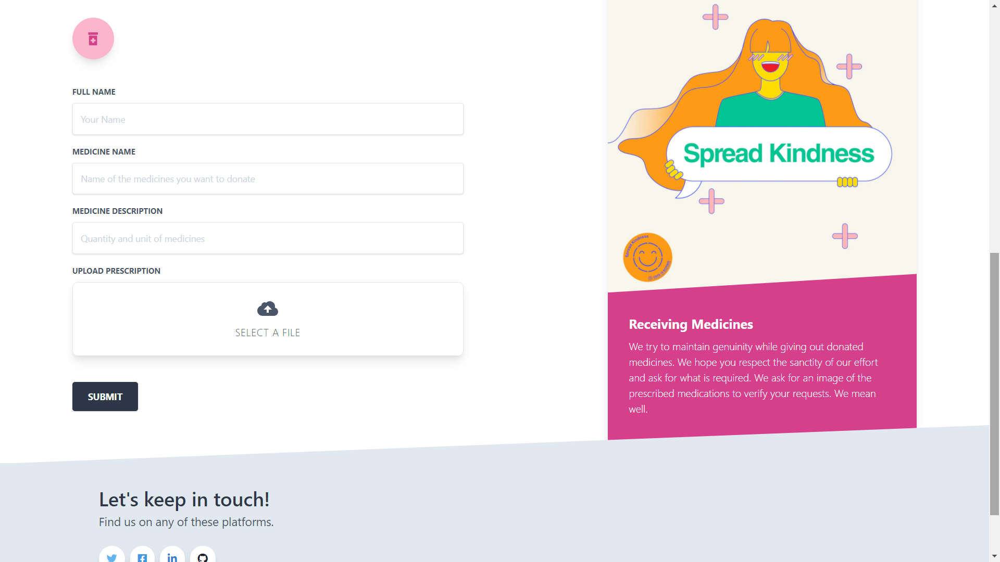

<!-- Tried to include all things of a basic readme.md -->
# Med-Aid

  
 

 
#### Everyone requires appropriate health care and a lot of people are not so fortunate to be able to afford all kinds of medicine. So we bring to you a platform where you can donate medicines and the person in need can easily receive and use the medicine which would have otherwise remained unsold or unused. 

> This project was an attempt towards [HackGujarat Hackathon](https://www.hackgujarat.com/) and my team comprised of me and [Anubhav Bagri](https://github.com/anubhavbagri).

### Contents

* [About](#about)
* [Challenges we ran into](#Challenges-we-ran-into)
* [Video Explanation](https://youtu.be/f1ZwlCLvU68)
* [Built Using](#built-using)
* [Acknowledgements](#acknowledgements)

---

## About

_https://med-aid.xyz_

During these testing times, everyone requires appropriate health care and a lot of people are not so fortunate to be able to afford all kinds of medicine. So we bring to you a platform where you can donate medicines and the person in need can easily receive and use the medicine which would have otherwise remained unsold or unused. All the pharmacists that sell or donate medicines using this platform are verified and have a license to sell medicines to ensure safety and legality of the transactions. Any person who is willing to give can donate medicines but medicines are accepted only after thorough checking and quality ensurance. People receiving will have to upload prescriptions to verify their needs. We do not take ask for any intermediate costs to make the transfer. This is because we want to help people who are in need of medication and cannot afford it.

**Verified Pharmacists** - All the pharmacists that sell or donate medicines using this platform are verified and have a license to sell medicines to ensure safety and legality of the transactions.

**Trusted Donors & Receivers** - Any person who is willing to give can donate medicines but medicines are accepted only after thorough checking and quality ensurance. People receiving will have to upload prescriptions to verify their needs.

**Non-Profit Platform** - We do not take ask for any intermediate costs to make the transfer. This is because we want to help people who are in need of medication and cannot afford it.

## Challenges we ran into

To make the complex backend structure, in such a short period of time, and making the website responsive and removing all the bugs. We invested a lot of effort into minute details such as icons and background colors in order to make it as user friendly as possible. We made use of the realtime database using firebase to store information instantly but couldn't retrieve it in due time. It was very difficult to implement all of it in such a short period of time. So, for the time-being we have shown dummy data in our webpages- the sole purpose is to explain our idea to everyone. Rest assured, all forms on our main page are working.  

## Built Using

- **HTML5, Tailwind CSS** : Website styling done with tailwind css.
- **Javascript** : Sending data to firebase through javascript.
- **Firebase** : To store data of all the forms used in our website.
- **Adobe Illustrator** : To design the project logo.

## Acknowledgements

* [Unsplash](https://source.unsplash.com/)
* [Creative Tim](https://www.creative-tim.com/blog/web-development/free-tailwind-css-templates-resources/)
* [Fontawesome](https://fontawesome.com/)
